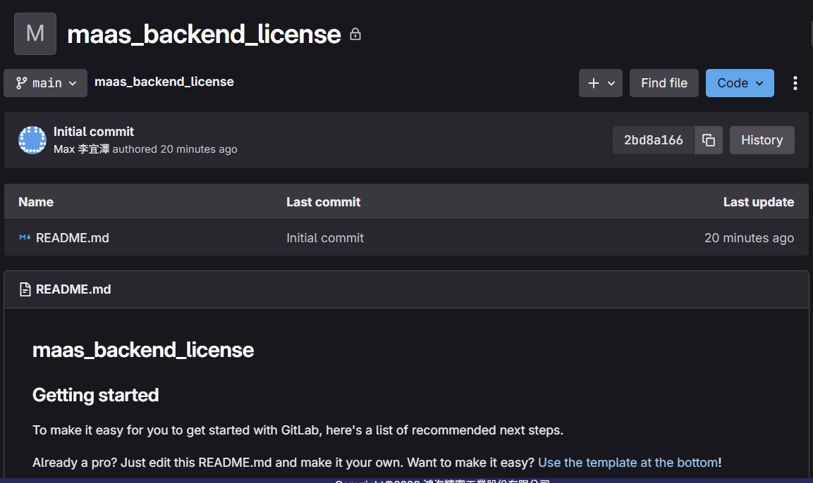
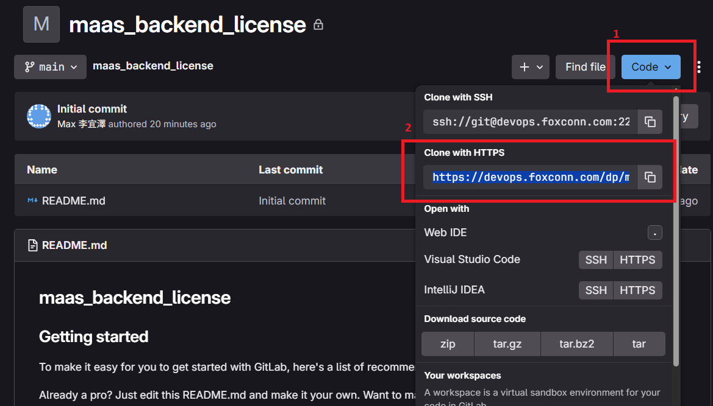
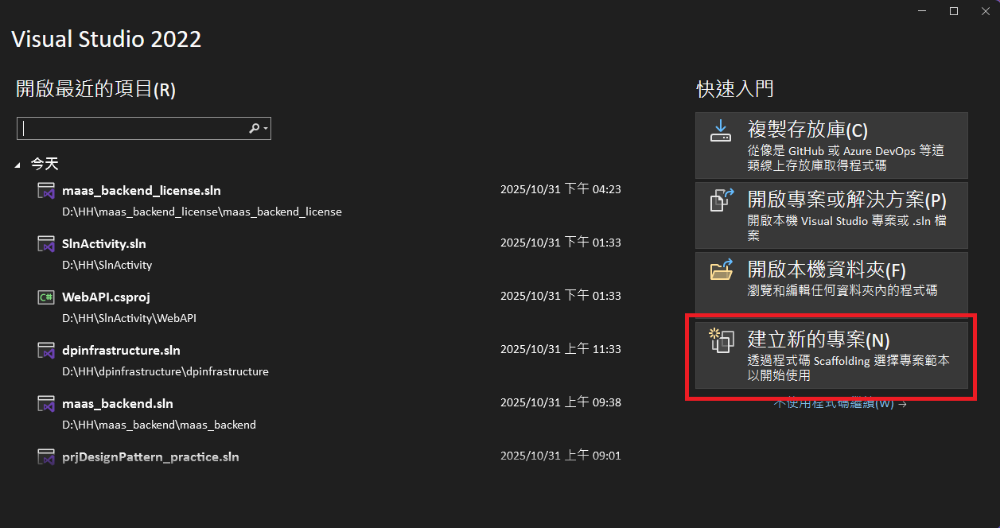
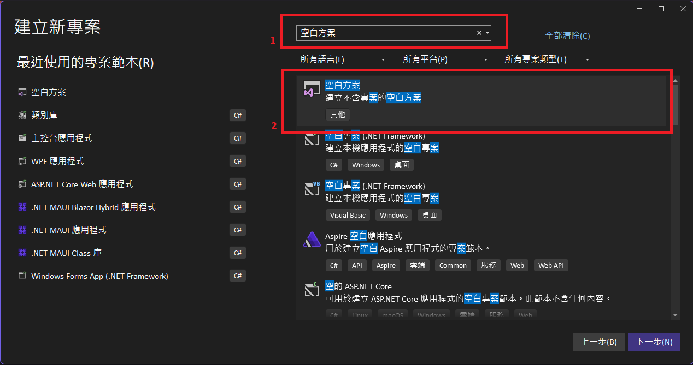
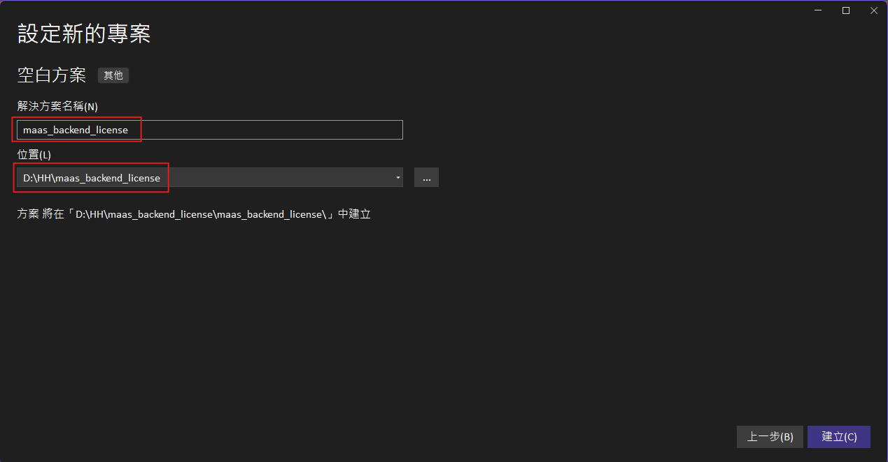

# Clone Repository 的方法

1. 管理員在 GitLab 上開好 Repository，此步驟需要請管理員操作

    

2. 用 HTTPS 將 Repository Clone 下來

    

3. 開啟 Visual Studio，建立空白方案

    
    

4. 名稱與 Repository 的名稱相同，位置選擇 Repository 的位置

    

5. 完成
